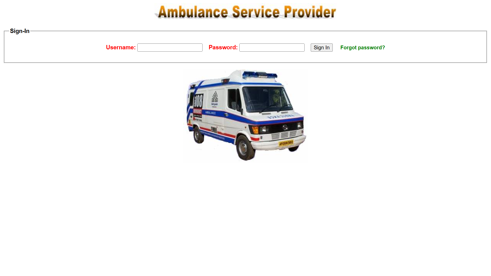
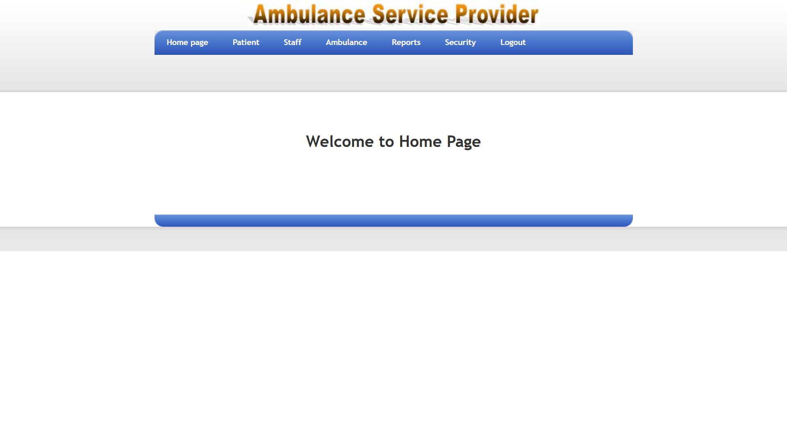
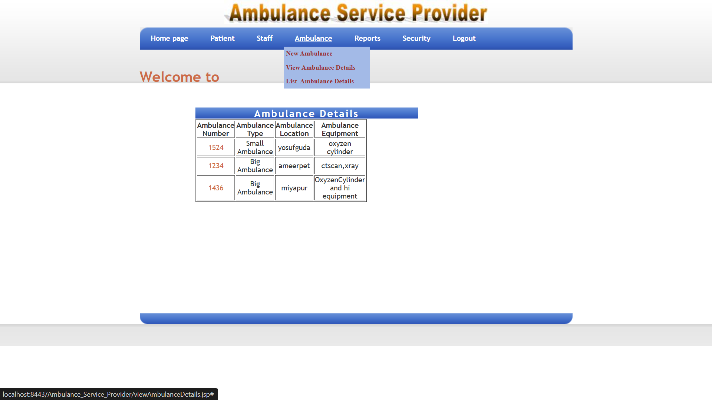
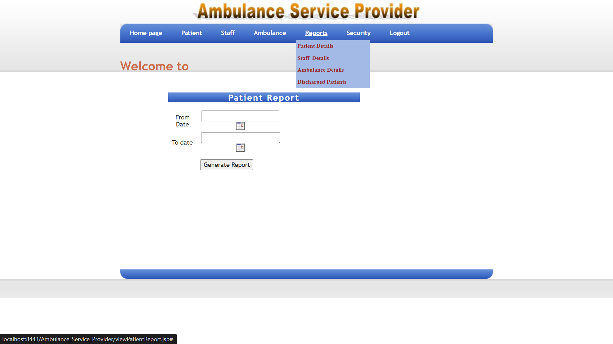
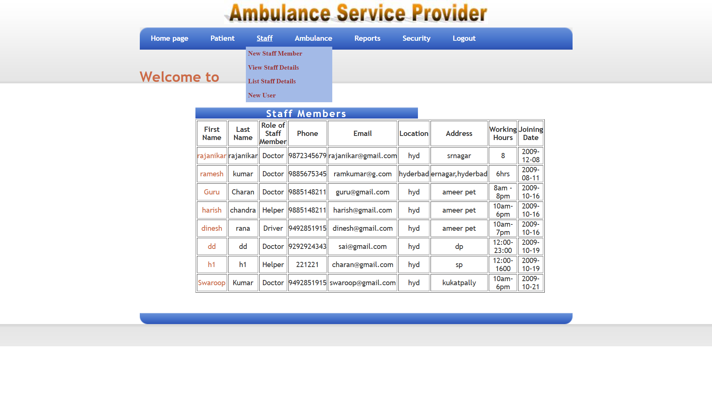

# Emergency Medical Transport (EMT)

## Project Overview

Emergency Medical Transport (EMT) is a web-based application developed using Java technologies to manage ambulance services and emergency patient transportation. The system helps hospitals and ambulance service providers efficiently coordinate medical transport services and manage staff such as doctors and medical personnel.

This project improves response time during medical emergencies and provides a centralized platform for managing ambulance operations.

---

## Technologies Used

* Java
* JSP (Java Server Pages)
* Servlets
* Oracle Database
* HTML
* CSS
* Apache Tomcat
* Eclipse IDE

---

## Features

* Doctor Management
* Staff Management
* Ambulance Service Handling
* Emergency Patient Transport
* Database Integration with Oracle
* Web-based hospital interface

---

## Project Screenshots

### Login Page

### Dashboard

### Ambulance List

### Booking Form

### Staff Profile

---

## Project Structure

* src – Java source files
* WebContent – JSP pages and web resources
* WEB-INF – Configuration files
* database – Oracle database scripts

---

## Purpose of the Project

The aim of this project is to develop a centralized system that helps hospitals manage ambulance services and emergency transportation efficiently.

---

## Author

Deepanshu Dixit
BCA Student – IGNOU
India
